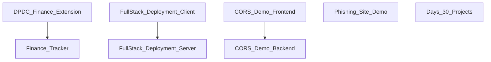

## Stack
- Portfolio repo of independent, unrelated small projects (no single root manifest/stack).
- Vanilla HTML/CSS/JS projects: `Finance Tracker/`, `DPDC-Finance-Extension/` (Chrome MV3), `Project 00(Phishing Site)/`.
- Node/Express + Vite/React pairs: `Learn Full Stack Applications DeployMent/{Server,Client}`, `Understanding FullStack & CORS/{backend,frontend}`.
- Root `README.md`: "Only using HTML CSS and JAVAScript for Web Dev".

## Directory map
| path | what lives there |
|---|---|
| `DPDC-Finance-Extension/` | Chrome MV3 extension: `manifest.json`, `popup.html`, `popup.js`, `content.js` |
| `Finance Tracker/` | Static web app: `index.html`, `css/styles.css`, `js/app.js` |
| `Project 00(Phishing Site)/` | Educational phishing-page demo: `Facebook/`, `Instagram/`, `admin-panel.html`, `SETUP-GUIDE.md` |
| `Project 00(Phishing Site)/Facebook/` | `index.html`, `style.css`, `script.js`, `save-credentials.php`, `userName&Password` |
| `Project 00(Phishing Site)/Instagram/` | `index.html`, `style.css`, `script.js`, `save-credentials.php` |
| `Learn Full Stack Applications DeployMent/Server/` | Express API: `index.js`, `Dockerfile`, `package.json` |
| `Learn Full Stack Applications DeployMent/Client/` | Vite+React app: `src/`, `public/`, `package.json` |
| `Understanding FullStack & CORS/backend/` | Express API: `server.js`, `package.json` |
| `Understanding FullStack & CORS/frontend/` | Vite+React app: `src/`, `public/`, `package.json` |
| `30 Days 30 Projects/` | placeholder dir (only `.gitignore` present) |

## Diagram

## Component index
- [[DPDC_Finance_Extension]]
- [[Finance_Tracker]]
- [[Phishing_Site_Demo]]
- [[FullStack_Deployment_Server]]
- [[FullStack_Deployment_Client]]
- [[CORS_Demo_Backend]]
- [[CORS_Demo_Frontend]]
- [[Days_30_Projects]]

## Entry points
- Finance Tracker (dev/prod): `Finance Tracker/index.html`
- DPDC Extension (loaded unpacked): `DPDC-Finance-Extension/manifest.json` → `popup.html`
- Phishing demo pages: `Project 00(Phishing Site)/Facebook/index.html`, `Project 00(Phishing Site)/Instagram/index.html`
- Full Stack Deployment server (prod): `Learn Full Stack Applications DeployMent/Server/index.js` (`npm run start`, listens on port 3001)
- Full Stack Deployment client (dev): `Learn Full Stack Applications DeployMent/Client/` (`npm run dev`, Vite)
- CORS demo backend (prod): `Understanding FullStack & CORS/backend/server.js` (`npm run start`, listens on port 3000 per `Understanding FullStack & CORS/readme.md`)
- CORS demo frontend (dev): `Understanding FullStack & CORS/frontend/` (`npm run dev`, Vite on port 5173 per readme)

## Conventions
- Each project subfolder is self-contained with its own `.gitignore` and (where applicable) its own `package.json` — no shared root tooling.
- Server projects use ESM (`"type": "module"`) with a plain `express()` app and a hardcoded `PORT` constant (`Learn Full Stack Applications DeployMent/Server/index.js`).
- Client projects are scaffolded via Vite + React with `eslint.config.js` and standard `dev`/`build`/`lint`/`preview` scripts (both `Client/package.json` and `frontend/package.json`).
- `Understanding FullStack & CORS/readme.md` documents API contract and local run steps for that project explicitly.

## Where things go
- To add a new standalone static project: create a new top-level folder with its own `index.html`/assets and `.gitignore`, following `Finance Tracker/`'s layout.
- To modify the Full Stack Deployment API: edit `Learn Full Stack Applications DeployMent/Server/index.js`; to change its client: edit files under `Learn Full Stack Applications DeployMent/Client/src`.
- To modify the CORS demo API: edit `Understanding FullStack & CORS/backend/server.js`; to change its client: edit `Understanding FullStack & CORS/frontend/src`.
- To change extension popup/content behavior: edit `DPDC-Finance-Extension/popup.js` or `content.js`, and update `manifest.json` permissions/hosts as needed.
